# JAVA Vityarthi BYOP BY 25BAI11043
# Student Performance Management System


## Overview

I built this project to make student record and marks management easier without having to calculate results manually every time. It is a Java application operated from a console which keeps track of student information, stores the marks according to subject, and automatically computes the percentage, the grade, and the pass/fail status.

- Modules: **Student Management, Marks Management, Performance Reports**
- Storage: **CSV file** (`students.csv`) for storing student records
- Validation: **Custom checked exceptions** for handling invalid input
- Testing: **16 test checks**, all passing

## Key Features

- Add, update, delete, and search students using ID or name
- Enter subject-wise marks with **0–100 validation**
- Automatically calculates **percentage and letter grade**
- Shows **class average, highest/lowest scorer, and pass/fail results**
- The changes are automatically saved and the student data is automatically reloaded from `students.csv`
- Separate tests are written for **Student, StudentManager, and FileManager**

## Technologies / Tools Used

- **Language**: Java (JDK 17+, built and tested on JDK 21)
- **Build**: plain `javac` / `java` no Maven, no Gradle
- **Storage**: flat-file CSV (`students.csv`) no database
- **Testing**: a hand-rolled test harness (`AppTest.java`) no JUnit or other framework
- **Version control**: Git / GitHub

## Table of Contents

- [Overview](#overview)
- [Key Features](#key-features)
- [Technologies / Tools Used](#technologies--tools-used)
- [Project Structure](#project-structure)
- [Requirements](#requirements)
- [Installation](#installation)
- [Configuration](#configuration)
- [Usage](#usage)
- [Testing](#testing)
- [Screenshots](#screenshots)
- [How It Works](#how-it-works)
- [Data File](#data-file)
- [Workflow](#workflow)
- [Troubleshooting](#troubleshooting)
- [Notes](#notes)
- [Key Classes & Methods](#key-classes--methods)
- [License](#license)
- [Contact](#contact)

## Project Structure

```
Vityarthi_Java_Project_25BAI11043/
├── Screenshots/                         
├── out/
│   ├── AppTest.class
│   ├── FileManager.class
│   ├── InvalidMarksException.class
│   ├── Main.class
│   ├── PerformanceReport.class
│   ├── Student.class
│   ├── StudentManager.class
│   └── StudentNotFoundException.class
├── src/
│   ├── Student.java                   # One student's data + grade/percentage math
│   ├── StudentManager.java            # CRUD on the in-memory roster
│   ├── PerformanceReport.java         # Individual + class-level report generation
│   ├── FileManager.java               # CSV save/load
│   ├── InvalidMarksException.java     # Custom checked exception - bad marks input
│   ├── StudentNotFoundException.java  # Custom checked exception - bad ID lookup
│   ├── Main.java                      # Console menu / entry point
│   └── AppTest.java                   # Dependency-free test harness
├── .gitignore
├── Project_Report.pdf                 # Detailed report, submitted separately on the portal
├── README.md
└── statement.md                       # Problem statement, scope, target users
```

`out/` is just what `javac` spits out locally, I'm not committing it. `.gitignore` keeps `out/`, `bin/`, `*.class`, and `students.csv` out of the repo, so only `src/`, `diagrams/`, and the docs actually get pushed.

## Requirements

| Requirement | Version |
|-------------|---------|
| JDK | 17+ (I built and tested this on JDK 21) |
| Build tool | None just `javac` / `java` |
| External libraries | None |

- **Hardware**: anything that can run a JVM
- **Storage**: basically nothing `students.csv` is a few bytes per student

## Installation

1. Clone it:
   ```bash
   git clone https://github.com/iampiyushsingh/Vityarthi_Java_Project_25BAI11043.git
   cd Vityarthi_Java_Project_25BAI11043
   ```
2. Check your Java version:
   ```bash
   java -version
   javac -version
   ```
   Both `java` and `javac` should report version 17 or higher.
   
   ```bash
   javac -d out src/*.java
   ```
   This compiles all Java source files in `src/` and places the generated `.class` files in `out/`. If no compilation errors are displayed, the project has compiled successfully.

## Configuration

The project does not require any special setup or configuration. Just run the program and start adding student records. The required students.csv file is created automatically when the first student is added.

## Usage

### Run it

```bash
java -cp out Main
```

which drops you into:

```
===== STUDENT PERFORMANCE MANAGEMENT SYSTEM =====
 1. Add Student
 2. Update Student
 3. Delete Student
 4. Search Student
 5. Enter Marks
 6. View Percentage & Grade
 7. Individual Report
 8. Class Average
 9. Highest/Lowest Marks
10. Pass/Fail Analysis
 0. Save & Exit
Enter your choice:
```

Type the number which corresponds to the operation you want to carry out and then carry out the instructions shown on the screen. Choose 0 if you want to save the data and exit the programme. The application also automatically saves the changes after each add, update, delete or marking of an entry, thus helping to avoid data loss.

### Run the tests

```bash
java -cp out AppTest
```

You should see this at the bottom:
```
===== TEST SUMMARY =====
Passed: 16   Failed: 0
```

## How It Works

### Student Management (`StudentManager`)
Keeps a plain `ArrayList<Student>` in memory with IDs that auto-increment from 1. `addStudent`, `updateStudent`, `deleteStudent`, `findById`, `searchByName` cover the basics. Try to update or delete an ID that doesn't exist and you get a `StudentNotFoundException` instead of a silent no-op.

### Marks Management (`Student`)
`addMarks(subject, marks)` checks the mark is between 0 and 100 and the subject isn't blank, anything else throws `InvalidMarksException`. Percentage is just total marks obtained divided by (number of subjects × 100). Grade comes off a fixed scale (A+ at 90%+, down to F below 40%), and 40% is the pass line.

### Performance Reports (`PerformanceReport`)
- `individualReport` : one student's full report card
- `classAverage` : mean percentage across everyone
- `highestLowest` : top and bottom scorer
- `passFailAnalysis` : who passed, who didn't, and the class pass rate

### Persistence (`FileManager`)
Each student becomes one CSV line: `id,name,subject:marks,subject:marks,...`. On startup it reads the file back, rebuilds every `Student`, and even restores `nextId` correctly so new students don't collide with old IDs. If a line's gotten corrupted somehow, it skips that record and prints a warning instead of crashing the whole load.

## Data File

| File | Purpose |
|------|---------|
| `students.csv` | The whole roster + marks, auto-generated. Delete it if you want to start over. |

## Workflow

```
Console input (Main) → StudentManager (CRUD) / Student (marks, grade, %)
                                    ↓
                    FileManager saves after every change
                                    ↓
                    students.csv persists between runs
                                    ↓
        PerformanceReport (average, highest/lowest, pass/fail)
```

## Testing

`AppTest.java` doesn't use any testing framework, just a `check()` helper and plain `main()`. It covers:
- Add / find / update / delete, including the exception path when the ID doesn't exist
- Grade and percentage math
- Rejecting out-of-range and negative marks
- Class average and pass/fail logic
- A full save-then-reload round trip through `FileManager`

Run it with `java -cp out AppTest`.


## Screenshots

### Main Menu
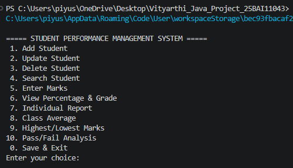

### Add Student
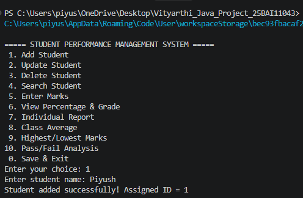

### Update Student
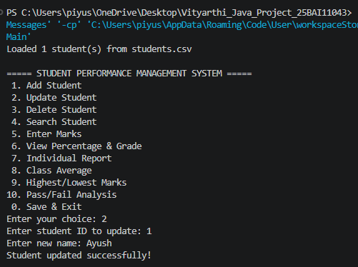

### Delete Student
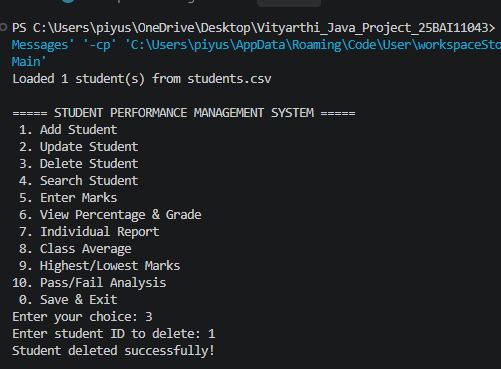

### Search Student
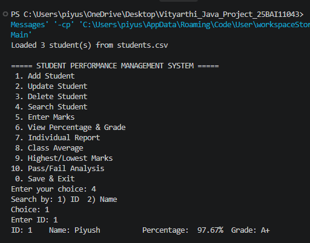

### Enter Marks
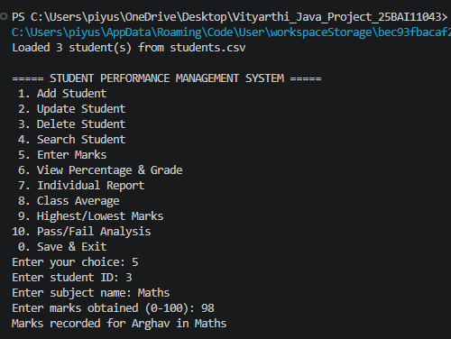

### Percentage and Grade
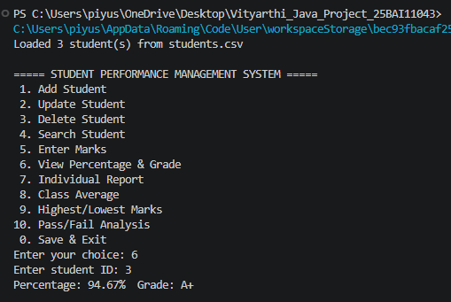

### Individual Report
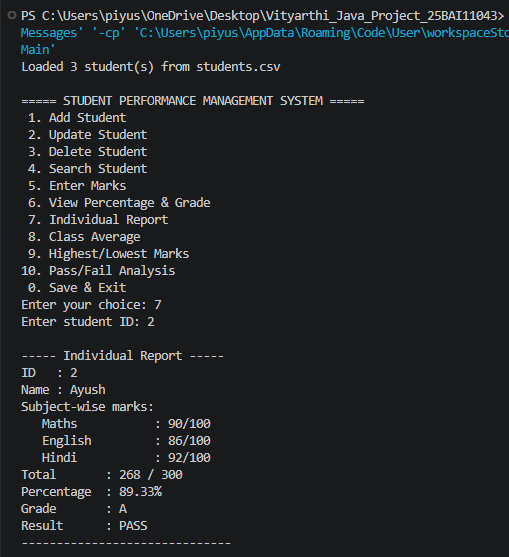

### Class Average
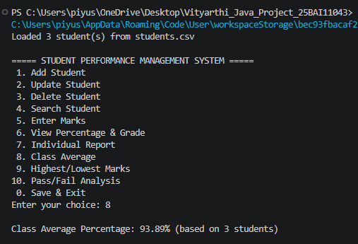

### Highest and Lowest Marks
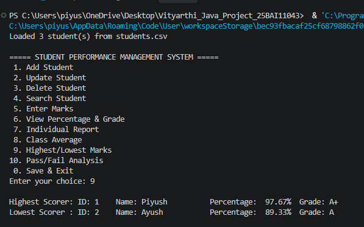

### Pass Fail Analysis
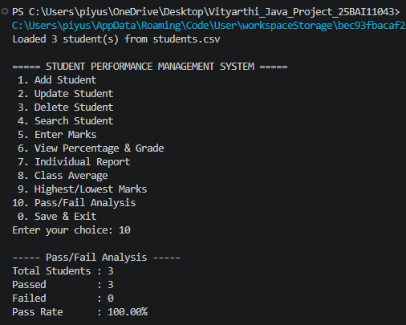

### Save and Load
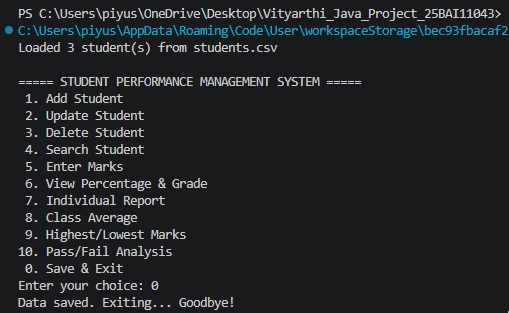

### Test Run
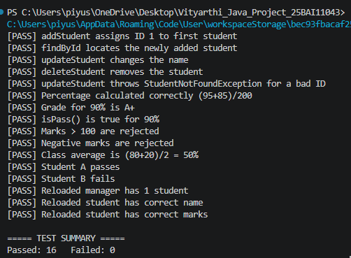


## Troubleshooting

| Problem | Fix |
|---------|-----|
| `'javac' is not recognized` / `command not found: javac` | JDK isn't installed, or isn't on your PATH, install JDK 17+. |
| `error: release version 21 not supported` | The installed JDK is older than JDK 21. Check `java -version` and `javac -version`. |
| `Could not find or load main class Main` | Run the command from the project root, and make sure `out/Main.class` actually exists (compile first). |
| Program exits or skips a prompt right away | Type a plain number with no stray spaces, then press Enter. |
| Data isn't there next time I run it | Run `java -cp out Main` from the exact same folder each time `students.csv` is relative to wherever you launch it from. |
| `Warning: skipped corrupted record` | Someone (probably me) hand-edited `students.csv` and broke a line fix or delete that line. |

## Notes

### Project Notes

- The data for all students is kept in one CSV file, which means that no setup is needed, no server is required and no additional software is necessary apart from the JDK.
- Reports are produced using the student data which has been loaded from the file students.csv when the program is started.
- The files `out/`, `bin/`, `*.class`, and `students.csv` are included in `.gitignore` since they are generated files and therefore not part of the source code.
- The full project report, with the diagrams and information about the testing, is included in `Project_Report.pdf`.


## Key Classes & Methods

- `Student.addMarks()` : validates and records one subject's marks
- `Student.getPercentage()` / `getGrade()` / `isPass()` : the derived numbers
- `StudentManager.addStudent()` / `updateStudent()` / `deleteStudent()` : roster CRUD
- `StudentManager.getByIdOrThrow()` : lookup that throws instead of returning null
- `FileManager.save()` / `load()` : the CSV round trip
- `PerformanceReport.individualReport()` / `classAverage()` / `highestLowest()` / `passFailAnalysis()` : the reporting side

## License

This project is part of an AIML course assignment at VIT Bhopal University.

## Contact

- **Project maintainer**: Piyush Kumar Singh
- **Email**: piyush.25bai11043@vitbhopal.ac.in
- **GitHub**: [@iampiyushsingh](https://github.com/iampiyushsingh)
